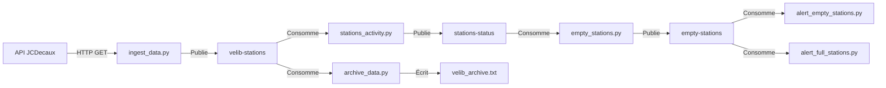

# 🚴 Velib Station Monitoring avec Apache Kafka

## 📋 Description du Projet

Ce projet implémente un système de surveillance en temps réel des stations Vélib' utilisant Apache Kafka comme plateforme de streaming de données. Le système collecte, traite et analyse les données des stations de vélos en libre-service via l'API JCDecaux, permettant de suivre l'activité des stations et de générer des alertes en temps réel.

## 🎯 Objectifs

- **Ingestion de données** : Récupération périodique des données des stations Vélib'
- **Traitement de flux** : Détection des changements d'état et génération d'événements
- **Alertes en temps réel** : Notification lorsque des stations deviennent vides ou se réapprovisionnent
- **Archivage** : Sauvegarde persistante des données pour analyse ultérieure
- **Monitoring** : Surveillance de l'infrastructure Kafka

## 🏗️ Architecture

Le système utilise une architecture basée sur Apache Kafka avec plusieurs topics :

```
API JCDecaux → velib-stations → stations-status → empty-stations
                      ↓
                velib_archive.txt
```

### Topics Kafka

1. **velib-stations** : Données brutes des stations (source)
2. **stations-status** : Événements de changement d'état
3. **empty-stations** : Événements de stations vides/réapprovisionnées

## 📁 Description des Fichiers Python

### 1. `ingest_data.py` 🔄

**Rôle** : Producteur principal qui ingère les données depuis l'API JCDecaux vers Kafka.

**Fonctionnement** :

- Interroge l'API JCDecaux toutes les 10 secondes
- Récupère les données de toutes les stations Vélib'
- Publie chaque station comme un message dans le topic `velib-stations`
- Utilise un `KafkaProducer` avec sérialisation JSON

**Caractéristiques clés** :

- Intervalle de polling : 10 secondes
- API Key JCDecaux intégrée
- Gestion des erreurs avec retry automatique
- Flush pour garantir l'envoi des messages

### 2. `stations_activity.py` 🔍

**Rôle** : Détecte les changements d'activité des stations et filtre les événements pertinents.

**Fonctionnement** :

- Consomme le topic `velib-stations` (données brutes)
- Compare l'état actuel avec l'état précédent de chaque station
- Détecte les changements de disponibilité (vélos disponibles, emplacements libres)
- Publie uniquement les changements dans le topic `stations-status`

**Logique de traitement** :

```python
# Détection de changement
if (vélos_disponibles != état_précédent.vélos) OR
   (emplacements_libres != état_précédent.emplacements):
    → Envoyer vers 'stations-status'
```

**Optimisation** : Réduit le volume de données en ne transmettant que les événements significatifs.

### 3. `empty_stations.py` 🚨

**Rôle** : Détecte les transitions vide/non-vide des stations et génère des événements spécifiques.

**Fonctionnement** :

- Consomme le topic `stations-status`
- Maintient un état interne pour chaque station (vide/non-vide)
- Détecte deux types de transitions :
  - **BECAME_EMPTY** : La station vient de devenir vide (0 vélos)
  - **BECAME_NON_EMPTY** : La station vient d'être réapprovisionnée (>0 vélos)
- Publie ces événements dans le topic `empty-stations`

**Logique de détection** :

```python
if was_not_empty AND now_empty:
    event = "BECAME_EMPTY"
elif was_empty AND now_not_empty:
    event = "BECAME_NON_EMPTY"
```

**Données enrichies** : Inclut numéro, nom, adresse, ville, et timestamp applicatif.

### 4. `alert_empty_stations.py` 🔔

**Rôle** : Consommateur d'alertes pour les stations qui deviennent vides.

**Fonctionnement** :

- Consomme le topic `empty-stations`
- Filtre uniquement les événements de type `BECAME_EMPTY`
- Affiche une alerte formatée avec :
  - Adresse de la station
  - Ville (contract_name)
  - Message d'avertissement visuel

**Format d'alerte** :

```
=============== A station just became EMPTY ===============
  Address : 123 Rue de Rivoli
  City    : Paris
```

**Cas d'usage** : Alerter les opérateurs pour réapprovisionner les stations vides.

### 5. `alert_full_stations.py` ✅

**Rôle** : Consommateur d'alertes pour les stations qui se réapprovisionnent.

**Fonctionnement** :

- Consomme également le topic `empty-stations`
- Filtre uniquement les événements de type `BECAME_NON_EMPTY`
- Affiche une notification de réapprovisionnement avec :
  - Nom de la station
  - Adresse
  - Ville
  - Nombre de vélos maintenant disponibles

**Format de notification** :

```
✅ STATION RÉAPPROVISIONNÉE 🚲
  Nom : Station République
  Adresse : Place de la République
  Ville : Paris
  Vélos disponibles : 5
----------------------------------------
```

**Cas d'usage** : Confirmer aux utilisateurs que des vélos sont à nouveau disponibles.

### 6. `archive_data.py` 💾

**Rôle** : Archiveur de données pour persistance et analyse historique.

**Fonctionnement** :

- Consomme le topic `velib-stations` depuis le début (earliest)
- Écrit chaque message dans le fichier `velib_archive.txt`
- Format : Une ligne JSON par station
- Flush régulier tous les 100 enregistrements pour éviter la perte de données

**Caractéristiques** :

- Mode append : N'écrase pas les données existantes
- Encodage UTF-8 pour les caractères spéciaux
- Counter pour suivre le nombre d'entrées archivées
- Timestamps pour traçabilité

**Cas d'usage** :

- Analyse historique des tendances
- Machine Learning / Data Science
- Audit et conformité

### 7. `monitor_kafka.py` 📊

**Rôle** : Outil de monitoring de l'infrastructure Kafka.

**Fonctionnement** :

- Se connecte au broker Kafka en tant qu'AdminClient
- Liste tous les topics disponibles
- Pour chaque partition de chaque topic :
  - Récupère l'offset courant (nombre de messages)
  - Affiche le timestamp de la mesure
- Rafraîchissement automatique toutes les 15 secondes

**Format de sortie** :

```
Topic-name, Partition-id, offset-id, timestamp
velib-stations,0,1523,2025-11-24 14:30:45
stations-status,0,456,2025-11-24 14:30:45
empty-stations,0,89,2025-11-24 14:30:45
```

**Utilité** :

- Vérifier que les producteurs publient correctement
- Surveiller le débit de messages
- Détecter les partitions en retard

### 8. `consumer.py` 📥

**Rôle** : Consommateur générique simple pour tests et débogage.

**Fonctionnement** :

- Consomme le topic `topic1` (utilisé pour les tests initiaux)
- Lit depuis le début (earliest)
- Affiche chaque message avec métadonnées :
  - Contenu du message
  - Topic
  - Partition
  - Offset

**Cas d'usage** :

- Apprentissage de l'API Kafka
- Tests de base
- Vérification rapide du contenu d'un topic

## 🚀 Installation et Configuration

### Prérequis

- Java 8+ (pour Kafka)
- Python 3.8+
- Apache Kafka 3.6.2
- Bibliothèques Python :
  ```bash
  pip install kafka-python requests
  ```

### Configuration Kafka

1. **Démarrer Zookeeper** (dans le répertoire Kafka) :

   ```powershell
   .\bin\windows\zookeeper-server-start.bat .\config\zookeeper.properties
   ```

2. **Démarrer Kafka Broker** :

   ```powershell
   .\bin\windows\kafka-server-start.bat .\config\server.properties
   ```

3. **Créer les topics** :
   ```powershell
   .\bin\windows\kafka-topics.bat --create --topic velib-stations --bootstrap-server localhost:9092 --partitions 1 --replication-factor 1
   .\bin\windows\kafka-topics.bat --create --topic stations-status --bootstrap-server localhost:9092 --partitions 1 --replication-factor 1
   .\bin\windows\kafka-topics.bat --create --topic empty-stations --bootstrap-server localhost:9092 --partitions 1 --replication-factor 1
   ```

## 🎬 Utilisation

### Démarrage du Pipeline Complet

1. **Ingestion de données** (Terminal 1) :

   ```powershell
   python ingest_data.py
   ```

2. **Détection d'activité** (Terminal 2) :

   ```powershell
   python stations_activity.py
   ```

3. **Détection de stations vides** (Terminal 3) :

   ```powershell
   python empty_stations.py
   ```

4. **Alertes stations vides** (Terminal 4) :

   ```powershell
   python alert_empty_stations.py
   ```

5. **Alertes réapprovisionnement** (Terminal 5) :

   ```powershell
   python alert_full_stations.py
   ```

6. **Archivage** (Terminal 6) :

   ```powershell
   python archive_data.py
   ```

7. **Monitoring** (Terminal 7) :
   ```powershell
   python monitor_kafka.py
   ```

## 📊 Flux de Données



## 🔧 Configuration API

Le projet utilise l'API JCDecaux pour les données Vélib'. Configuration dans `ingest_data.py` :

```python
API_KEY = "f181de647beeff09ab27226e7169e95273dee1c0"
API_URL = f"https://api.jcdecaux.com/vls/v1/stations?apiKey={API_KEY}"
POLL_INTERVAL = 10  # secondes
```

## 📈 Cas d'Usage

### 1. Surveillance Opérationnelle

- Détecter les stations nécessitant un réapprovisionnement
- Optimiser les tournées de rééquilibrage
- Suivre la performance du service en temps réel

### 2. Analyse de Données

- Étudier les patterns d'utilisation
- Identifier les stations les plus populaires
- Prédire les besoins futurs

### 3. Expérience Utilisateur

- Alertes proactives pour les utilisateurs
- Information en temps réel sur la disponibilité
- Notifications push personnalisées

## 🛠️ Technologies Utilisées

- **Apache Kafka 3.6.2** : Plateforme de streaming distribuée
- **Python 3.x** : Langage de programmation
- **kafka-python** : Client Kafka pour Python
- **requests** : Bibliothèque HTTP pour Python
- **API JCDecaux** : Source de données Vélib'

## 📝 Structure du Projet

```
kafka_2.13-3.6.2/
├── bin/                          # Scripts Kafka
├── config/                       # Configurations Kafka
├── logs/                         # Logs Kafka
├── ingest_data.py               # Producteur principal
├── stations_activity.py         # Détection changements
├── empty_stations.py            # Détection vide/plein
├── alert_empty_stations.py      # Alertes vide
├── alert_full_stations.py       # Alertes réapprovisionnement
├── archive_data.py              # Archivage données
├── monitor_kafka.py             # Monitoring Kafka
├── consumer.py                  # Consommateur test
├── velib_archive.txt            # Archive données
└── README.md                    # Ce fichier
```

## 🔒 Sécurité et Bonnes Pratiques

- ⚠️ **API Key** : En production, utiliser des variables d'environnement
- ✅ **Gestion des erreurs** : Try/catch dans tous les scripts
- ✅ **Auto-commit** : Activé pour éviter la perte de messages
- ✅ **Flush régulier** : Garantit la persistance des données

## 🚦 Statuts et Monitoring

Le système permet de suivre :

- Nombre de messages par topic
- Offsets de consommation
- Latence des traitements
- Taux d'erreur

## 📚 Ressources

- [Documentation Apache Kafka](https://kafka.apache.org/documentation/)
- [API JCDecaux](https://developer.jcdecaux.com/)
- [kafka-python Documentation](https://kafka-python.readthedocs.io/)

## 👥 Auteur

Projet réalisé dans le cadre d'un laboratoire sur Apache Kafka et le traitement de flux de données en temps réel.

## 📄 Licence

Ce projet contient Apache Kafka qui est sous licence Apache 2.0. Voir les fichiers `LICENSE` et `NOTICE` pour plus de détails.

---

**Date de création** : Novembre 2025  
**Version Kafka** : 3.6.2  
**Version Python** : 3.8+
